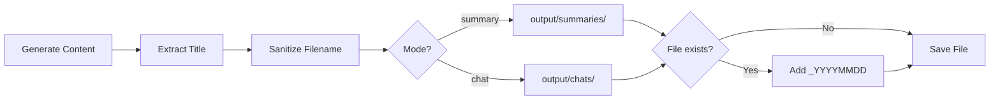

# Output Structure - Before vs After

## Visual Comparison

### BEFORE (Old Structure)
```
PodChat/
└── summaries/
    ├── podcast-summary-20260130-031322-HlG_cYRydHY.md
    ├── podcast-chat-20260130-023123-MWMe7yjPYpE.md
    ├── podcast-summary-20260130-024922-w5DcGBv-cqg.md
    └── podcast-chat-20260130-025252-w5DcGBv-cqg.md
```

**Problems:**
- ❌ All files mixed together (summaries and chats)
- ❌ Cryptic filenames with timestamps and video IDs
- ❌ Hard to find specific content
- ❌ Not user-friendly

### AFTER (New Structure)
```
PodChat/
└── output/
    ├── summaries/
    │   ├── cursor_20_expert_tips_and_hacks_for_ai_assisted_de_summary.md
    │   ├── the_path_to_advanced_machine_intelligence_summary.md
    │   └── building_scalable_microservices_with_kubernetes_summary.md
    └── chats/
        ├── cursor_20_expert_tips_and_hacks_for_ai_assisted_de_chat.md
        ├── the_path_to_advanced_machine_intelligence_chat.md
        └── building_scalable_microservices_with_kubernetes_chat.md
```

**Benefits:**
- ✅ Clear separation between summaries and chats
- ✅ Human-readable filenames based on video titles
- ✅ Easy to find specific content
- ✅ Professional organization
- ✅ Scalable structure

## Filename Transformation Examples

| Video Title | Old Filename | New Filename |
|------------|-------------|--------------|
| "Cursor 2.0: Expert Tips and Hacks for AI-Assisted Development" | `podcast-summary-20260130-031322-HlG_cYRydHY.md` | `cursor_20_expert_tips_and_hacks_for_ai_assisted_de_summary.md` |
| "The Path to Advanced Machine Intelligence" | `podcast-summary-20260130-024008-MWMe7yjPYpE.md` | `the_path_to_advanced_machine_intelligence_summary.md` |
| "Building Scalable Microservices with Kubernetes" | `podcast-chat-20260130-025252-w5DcGBv-cqg.md` | `building_scalable_microservices_with_kubernetes_chat.md` |

## File Organization Flow



## Key Features

### 1. Automatic Title Extraction
- Reads first `# heading` from generated content
- Uses sanitized version for filename
- Falls back to video_id if no title found

### 2. Smart Sanitization
- Converts "Cursor 2.0: Expert Tips!" to `cursor_20_expert_tips`
- Removes special characters
- Keeps content searchable and readable
- Limits length to 50 characters

### 3. Duplicate Prevention
First generation: `video_title_summary.md`
Second generation (same day): `video_title_summary_20260130.md`

### 4. Mode Separation
- Summaries → `output/summaries/`
- Chats → `output/chats/`
- Easy to find what you need
- Clean project structure

## Migration Path

**No manual migration needed!**
- New files automatically use new structure
- Old files remain in `./summaries/` (unchanged)
- Gradual transition as you generate new content
- Both structures coexist peacefully

## What's Next?

After running PodChat, you'll see:
```
PodChat/
├── summaries/          ← Old files (legacy, untouched)
│   └── ...
└── output/            ← New files (organized by mode)
    ├── summaries/
    └── chats/
```

You can safely:
- Continue using old files
- Delete old files when ready
- Move old files to new structure manually (if desired)
- Or just enjoy the new organization going forward! 🎉
